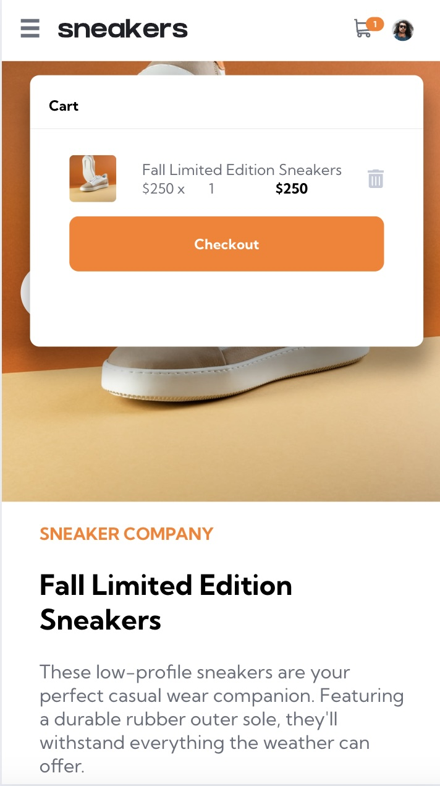
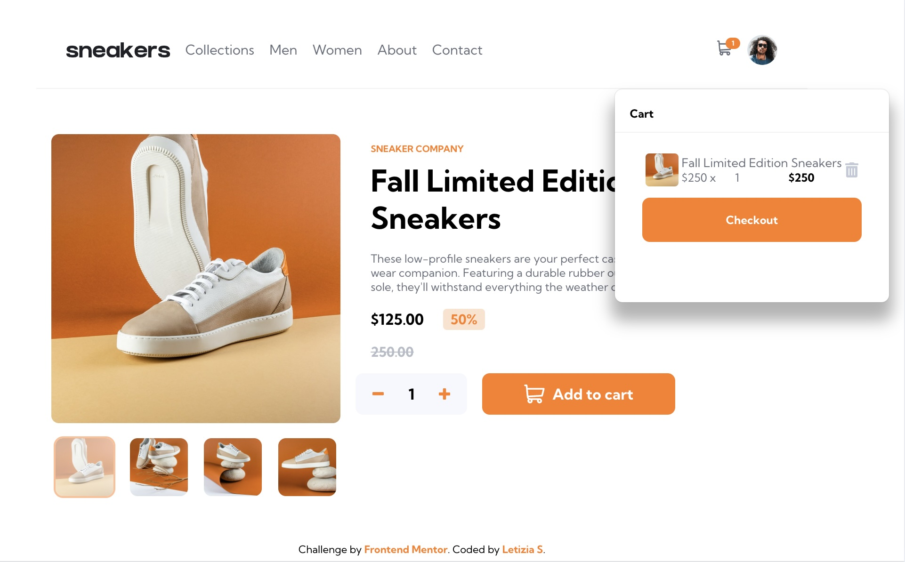

# Frontend Mentor - E-commerce product page solution

This is a solution to the [E-commerce product page challenge on Frontend Mentor](https://www.frontendmentor.io/challenges/ecommerce-product-page-UPsZ9MJp6).

## Table of contents

- [Overview](#overview)
  - [The challenge](#the-challenge)
  - [Screenshot](#screenshot)
  - [Links](#links)
- [My process](#my-process)
  - [Built with](#built-with)
  - [What I learned](#what-i-learned)
- [Author](#author)

## Overview

### The challenge

Users should be able to:

- View the optimal layout for the site depending on their device's screen size
- See hover states for all interactive elements on the page
- Open a lightbox gallery by clicking on the large product image
- Switch the large product image by clicking on the small thumbnail images
- Add items to the cart
- View the cart and remove items from it

### Screenshot

<!--  -->

### Links

- Solution URL: [Add solution URL here](https://your-solution-url.com)
- Live Site URL: [Add live site URL here](https://your-live-site-url.com)

## My process

### Built with

- Semantic HTML5 markup
- CSS custom properties
- CSS Grid and Flexbox layout
- Mobile-first workflow
- [Vite] (https://vitejs.dev/) - for building the project
- [TypeScript] (https://www.typescriptlang.org/) - for type checking
- [React](https://reactjs.org/) - JS library for building the UI
- [Redux Toolkit](https://redux-toolkit.js.org) - redux toolkit package for state management

### What I learned

Completing this challenge demonstrates proficiency in several key areas:

- User Interaction Design: Enhancing user experience through intuitive design.
- Event Handling: Efficiently managing user actions and interactions.
- Dynamic Content Updating: Implementing real-time updates without reloading the page.
- Data Handling and Manipulation: Managing and processing data effectively.
- State Management: Using tools like Redux Toolkit for maintaining application state.
- DOM Manipulation: Updating the Document Object Model dynamically.
- Responsive Design and Layout: Ensuring the application works seamlessly across different devices and screen sizes.

## Author

- Website - [Letizia](https://letiziasorrentino.com)
- Frontend Mentor - [@letizia-sorrentino](https://www.frontendmentor.io/profile/letizia-sorrentino)
- LinkedIn - [@letiziasorrentino](https://www.linkedin.com/in/letiziasorrentino/)
